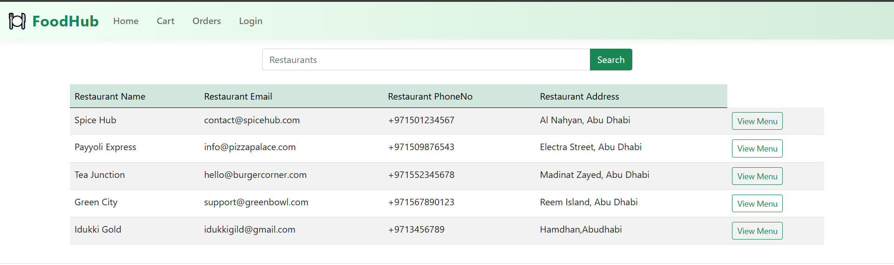
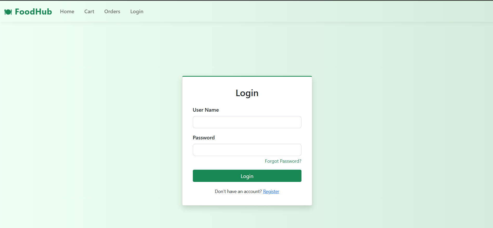
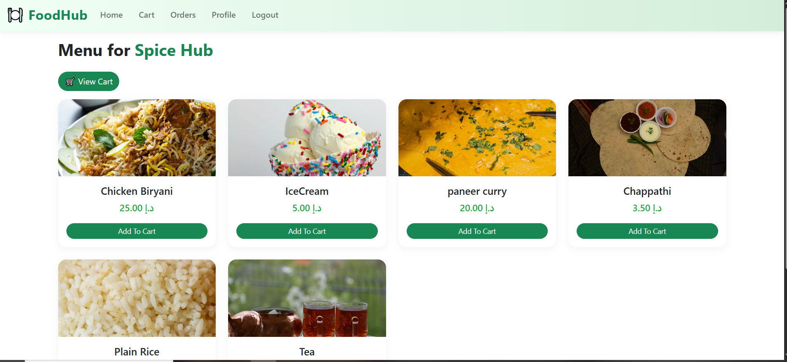
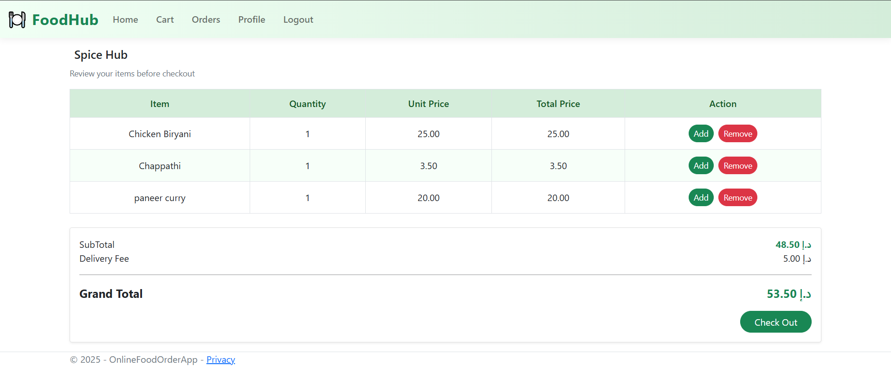
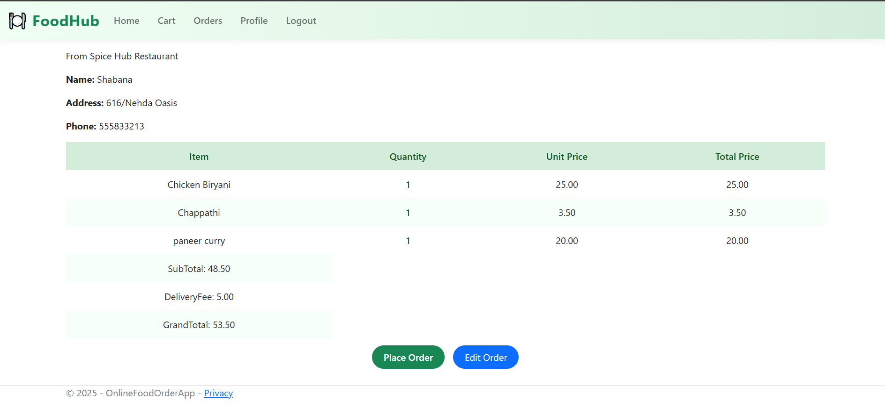
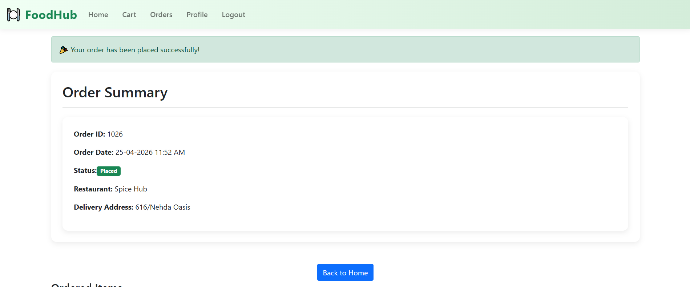
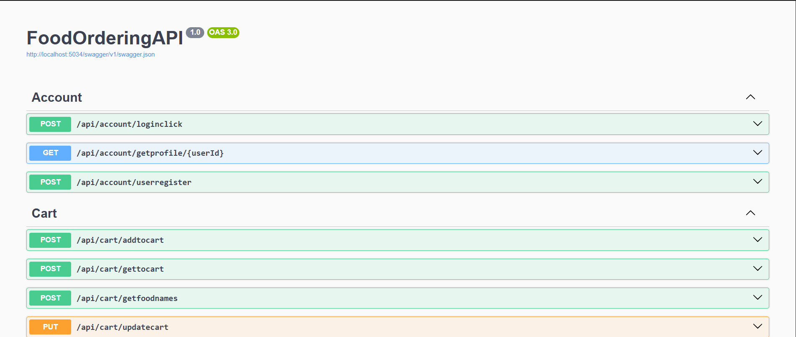

# 🍽️ Online Food Ordering App
🌐 **Live Demo:** [Click here to view the app](https://foodorderapp-mvc-ehhcb0geb2fuc2hw.centralus-01.azurewebsites.net)
A full-stack online food ordering web application built with **ASP.NET Core MVC** and **ASP.NET Core Web API**. The project was initially developed as a monolithic MVC application and later refactored to a clean **API + MVC separated architecture** — demonstrating real-world growth and architectural thinking.

---

## 🏗️ Architecture

```
┌─────────────────────────┐         ┌─────────────────────────┐
│   ASP.NET Core MVC      │  HTTP   │   ASP.NET Core Web API  │
│   (Presentation Layer)  │ ──────► │   (Business Logic Layer)│
│                         │         │                         │
│  - Views (Razor)        │         │  - Controllers          │
│  - ViewModels           │         │  - DTOs                 │
│  - Service Layer        │         │  - Entity Framework     │
│  - Session Management   │         │  - SQL Server DB        │
└─────────────────────────┘         └─────────────────────────┘
```

> The MVC project communicates with the API via `HttpClient`. All business logic and data access lives in the API layer. The MVC layer handles only UI rendering and session management.

---

## ✨ Features

### 🔐 Authentication & Session
- User Registration with form validation
- User Login with secure session management
- **Guest user session** — browse and add to cart without logging in
- Guest users are prompted to login at checkout
- **Cart conflict resolution** — guest cart is intelligently merged with the logged-in user's cart

### 🍴 Restaurant & Menu
- Browse all available restaurants
- View menu items per restaurant
- **One restaurant per order rule** enforced — cart is scoped to a single restaurant
- Search and filter restaurants *(in progress)*

### 🛒 Cart & Ordering
- Add items to cart
- Update cart quantities
- Remove items from cart
- Place orders with **Cash on Delivery**

### 📦 Order Management
- Order history page — view all past orders
- Real-time order status tracking:

```
Placed ──► Preparing ──► Out for Delivery ──► Delivered
```

### 👤 User Profile
- Minimal user profile with basic personal information

---

## 🛠️ Tech Stack

| Layer | Technology |
|---|---|
| Frontend | ASP.NET Core MVC, Razor Views, Bootstrap 5 |
| Backend API | ASP.NET Core Web API |
| ORM | Entity Framework Core |
| Database | Microsoft SQL Server |
| Authentication | Session-based Authentication |
| HTTP Communication | HttpClient (Service Layer) |
| Icons | Bootstrap Icons |

---

## 📁 Project Structure

```
OnlineFoodOrderApp/
│
├── OnlineFoodOrderApp.MVC/          # MVC Presentation Layer
│   ├── Controllers/                 # MVC Controllers
│   ├── Views/                       # Razor Views
│   ├── ViewModel/                   # ViewModels for UI
│   ├── Services/                    # HttpClient Service Layer
│   └── DTOs/                        # Data Transfer Objects
│
└── OnlineFoodOrderApp.API/          # Web API Layer
    ├── Controllers/                 # API Controllers
    ├── Models/                      # DB Entity Models
    ├── DTOs/                        # API Request/Response DTOs
    └── Data/                        # EF Core DbContext
```

---

## 🚀 Getting Started

### Prerequisites
- [.NET 8 SDK](https://dotnet.microsoft.com/download)
- [SQL Server](https://www.microsoft.com/en-us/sql-server)
- [Visual Studio 2022](https://visualstudio.microsoft.com/) or VS Code

### Setup Steps

**1. Clone the repository**
```bash
git clone https://github.com/yourusername/OnlineFoodOrderApp.git
cd OnlineFoodOrderApp
```

**2. Set up the Database**
- Open SQL Server Management Studio (SSMS)
- Run the provided SQL script to create the database and tables

**3. Configure Connection String**

In `OnlineFoodOrderApp.API/appsettings.json`:
```json
{
  "ConnectionStrings": {
    "DefaultConnection": "Server=YOUR_SERVER;Database=OnlineFoodOrderDB;Trusted_Connection=True;"
  }
}
```

**4. Run the API Project first**
```bash
cd OnlineFoodOrderApp.API
dotnet run
# API runs on http://localhost:5034
```

**5. Run the MVC Project**
```bash
cd OnlineFoodOrderApp.MVC
dotnet run
# MVC runs on http://localhost:XXXX
```

**6. Open in Browser**
```
http://localhost:XXXX
```

---

## 🔑 Key Design Decisions

- **Separation of Concerns** — MVC handles UI and session, API handles all business logic and data
- **ViewModel Pattern** — Dedicated ViewModels for each view, never exposing DB entities to UI
- **DTO Pattern** — Separate DTOs for API requests and responses, protecting DB models
- **Service Layer in MVC** — All HttpClient calls are abstracted into a service layer, keeping controllers clean
- **Guest Session** — Users can browse and build a cart without an account, improving UX
- **Cart Conflict Resolution** — Smart merging of guest and authenticated user carts on login

---

## 🔒 Security
- Session-based authentication
- Role hardcoded server-side (`Customer`) — cannot be tampered via request
- DB entities never exposed directly to API input (DTO pattern)
- Password hashing with BCrypt 

---

## 📌 In Progress
- [ ] Search and filter for restaurants and menu items

---

## 👨‍💻 Developer Note

This project started as a standard ASP.NET Core MVC application with direct database access. It was later refactored to introduce a **Web API layer**, separating concerns and simulating a real-world architecture where the frontend and backend are independently deployable. This refactor was done intentionally to demonstrate understanding of API-driven development patterns.

---

## 📄 License
This project is intended for portfolio and interview purposes.

## Screenshots

## Home Page



## Login Page



## Menu Page



## Cart Page



## Checkout Page



## Order Summary Page



## Swagger UI


